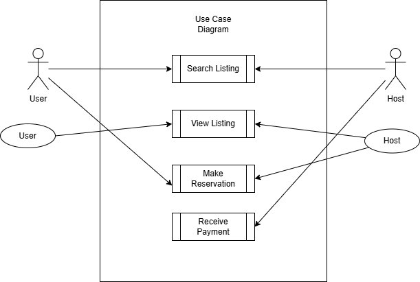

# Requirement Analysis in Software Development.
This repository will be used to collect and analyze requirements for the Airbnb Clone Project.

# What is Requirement Analysis?
Requirement Analysis is a systematic process in the software development lifecycle (SDLC) that involves identifying, documenting, and managing the needs and expectations of stakeholders for a new or modified product. It ensures that the development team understands what the users and business require from the system, reducing ambiguity and setting a clear foundation for design, development, and testing. Requirement Analysis is crucial for aligning the final product with business goals and user needs.

# Why is Requirement Analysis Important?
- **Prevents Miscommunication:** Clearly defined requirements help avoid misunderstandings between stakeholders and the development team, ensuring everyone has a shared vision.
- **Reduces Project Risks:** Early identification and clarification of requirements minimize the risk of costly changes, rework, or project failure.
- **Improves Product Quality:** Well-analyzed requirements lead to a product that meets user needs, resulting in higher satisfaction and fewer defects.

# Key Activities in Requirement Analysis
- **Requirement Gathering:** Collecting information from stakeholders through interviews, surveys, and observation.
- **Requirement Elicitation:** Engaging stakeholders to uncover their needs, expectations, and constraints.
- **Requirement Documentation:** Recording requirements in a clear, organized, and accessible format.
- **Requirement Analysis and Modeling:** Evaluating and structuring requirements to resolve conflicts, prioritize needs, and create models (e.g., diagrams).
- **Requirement Validation:** Ensuring requirements are complete, feasible, and aligned with business objectives through reviews and feedback.

# Types of Requirements

## Functional Requirements
Functional requirements specify what the system should do—its features and functions.
**Examples for Booking Management Project:**
- Users can search for available properties by location and date.
- Users can book a property and receive a confirmation email.
- Hosts can add, edit, or remove property listings.

## Non-functional Requirements
Non-functional requirements define how the system performs its functions—quality attributes and constraints.
**Examples for Booking Management Project:**
- The system must handle up to 10,000 concurrent users.
- Booking confirmation emails should be sent within 2 minutes of booking.
- The application must be accessible on mobile and desktop devices.

# Use Case Diagrams
Use Case Diagrams visually represent the interactions between users (actors) and the system, showing the system’s functionality from a user’s perspective. They help clarify requirements, identify actors, and define system boundaries.

**Benefits:**
- Simplifies complex requirements.
- Enhances communication among stakeholders.
- Identifies system scope and user interactions.

# Acceptance Criteria
Acceptance Criteria are specific, measurable conditions that a software product must satisfy to be accepted by stakeholders. They ensure that requirements are testable and that the delivered feature meets user expectations.

**Importance:**
- Provides a clear definition of “done.”
- Guides development and testing.
- Reduces ambiguity and scope creep.

**Example (Checkout Feature):**
- The user can review their booking details before payment.
- The system calculates the total price, including taxes and fees.
- The user receives a confirmation message and email after successful payment.
- Payment is processed securely using